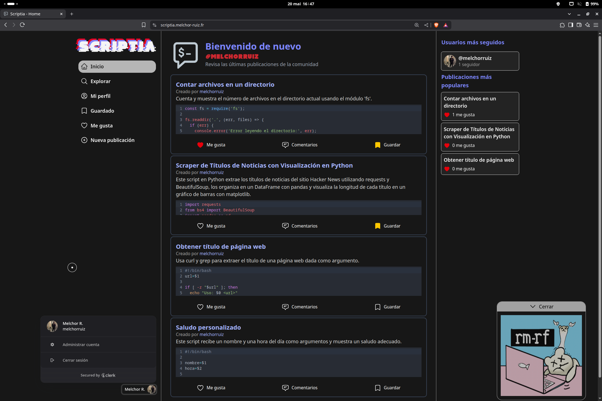
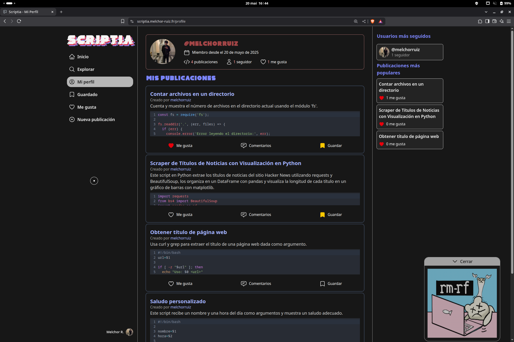
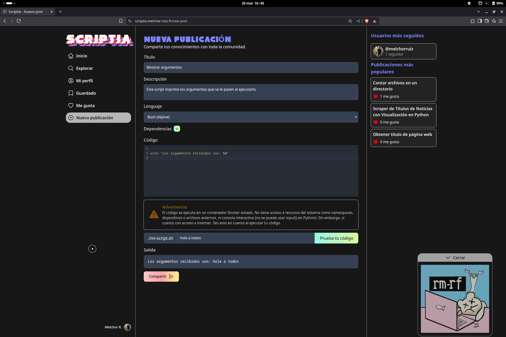
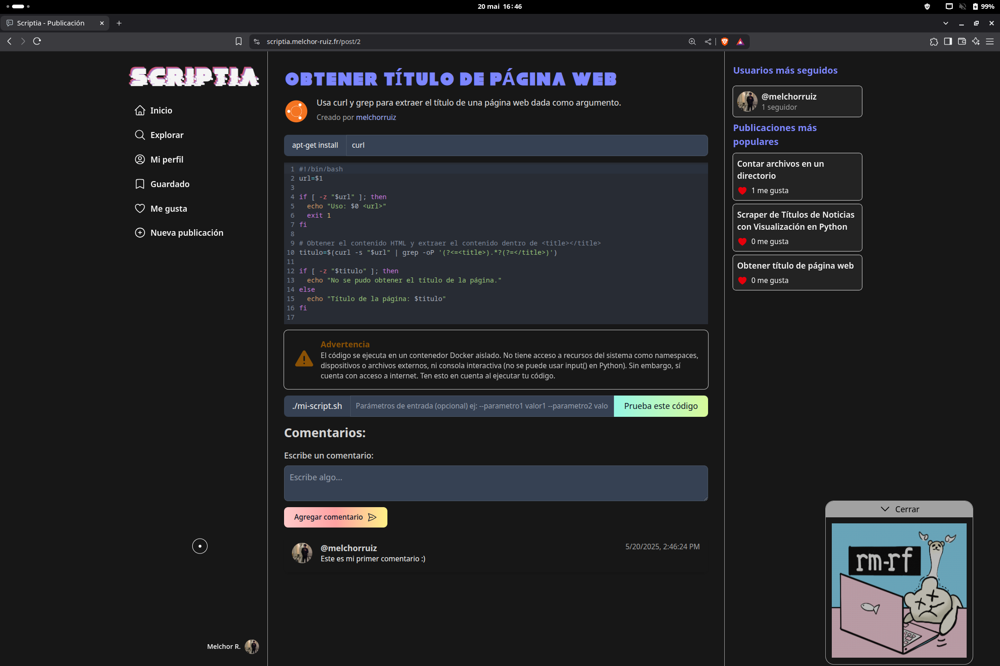

# SCRIPTIA

    

## Descripción

Scriptia es una red social diseñada para los entusiastas de Linux. Aquí puedes crear, probar y compartir tus propios scripts hechos en Bash, Python o NodeJs, conocer a otros usuarios apasionados y aprender mucho de toda la comunidad.
La aplicación incluye un playground hecho con Docker para la ejecución de código, lo que permite que los usuarios puedan instalar las dependencias que necesiten y que la ejecución de código sea en un entorno aislado.

# Demo
https://scriptia.melchor-ruiz.fr/

# Capturas de pantalla

# ¿Cómo se ha utilizado Clerk?

Clerk gestiona el registro, inicio de sesión y sesiones de los usuarios. Solo guardo el ID único que genera Clerk en mi base de datos, y no datos sensibles. Esto asegura que solo usuarios registrados puedan publicar y ver contenido.
